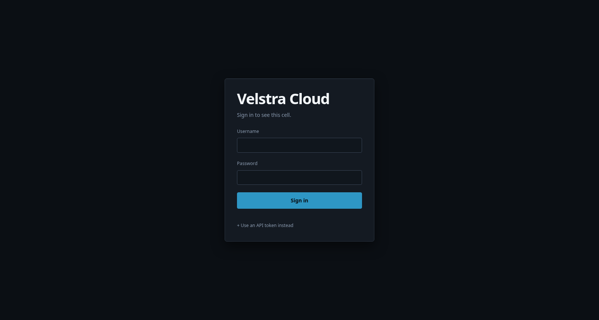
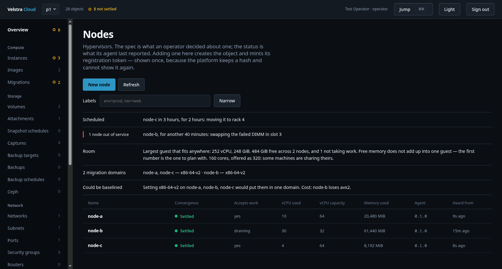
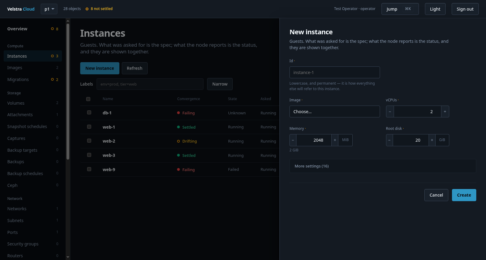
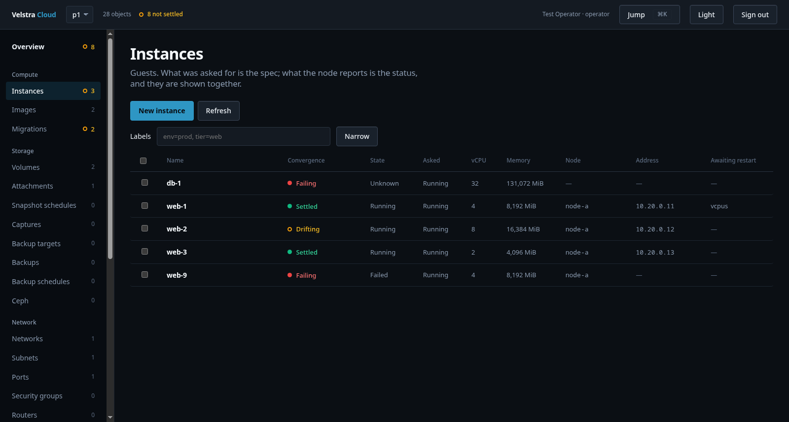
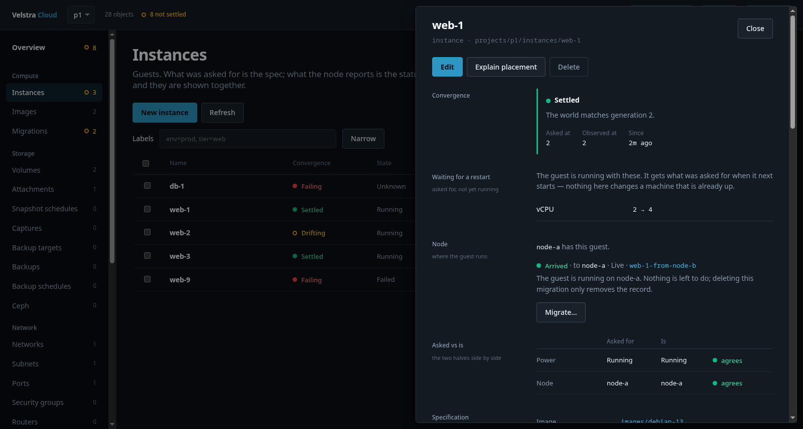
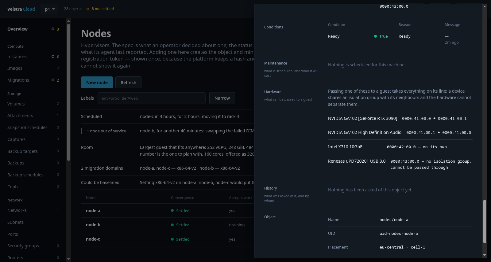

# Quick start

One machine, from nothing to a guest you can log into. Twenty minutes, most of
it waiting for a download.

If you have three machines rather than one, start here anyway: a cell of one is
the same platform with fewer boxes in it, and adding the others afterwards is
[§2 of the setup guide](setup-guide.md).

> The pictures below are of the real console, driven in a browser against the
> contract fixture the test suite runs against — not a production cell and not a
> mock-up. `velstra-cloud-console/tests/console/run-shots.sh docs/images` takes
> them again.

---

## What you need

* A machine with virtualisation enabled in its firmware — check with
  `grep -c 'vmx\|svm' /proc/cpuinfo`; zero means it is off, not absent.
* 8 GiB of memory is comfortable. The control plane itself fits in 2.
* **Debian 13** (trixie) or NixOS. Not Debian 12: the binaries need glibc 2.39
  and bookworm ships 2.36, so `apt` refuses the package rather than installing
  something that cannot start. Anything else works too, but you would be
  building the package yourself.

You do **not** need: a second machine, shared storage, a Ceph cluster, a fabric,
or a spare public address. All of those are things you add when you have a
reason, and the platform says what changes when you do.

---

## 1. Install it

```
sudo apt install ./velstra-cloud_*.deb
sudo velstra-cloud-node quickstart
```

`apt install ./file.deb`, not `dpkg -i`: dpkg does not resolve dependencies, so
it unpacks the package and then leaves it unconfigured with a complaint about
systemd. apt pulls what is needed and configures it.

**That is the whole install.** `quickstart` asks three things — a name for the
machine, who should be able to reach the console, and the administrator's
password — and then does what the rest of this guide describes by hand: writes
the seed, brings up etcd and the control plane, creates the node object, moves
its one-time token, creates the storage pool, and starts the agents.

It is safe to run again. Nothing it does is created twice, so a run that failed
half way is fixed by running it again rather than by reinstalling.

Two things it deliberately does not do. It refuses on NixOS, where units are a
declaration and a command that enabled them behind your back would be fighting
the operating system — use the module (§0 of the [setup guide](setup-guide.md)).
And it does not install QEMU: if there is none, the seed says `fake` and says so
at the end, because a guest that is silently recorded instead of run is the
worst of both.

```
sudo apt install etcd-server qemu-system-x86 qemu-utils
```

before it, and you have a cell that runs real machines.

<details>
<summary>Doing it by hand instead</summary>

`velstra-cloud-node setup` asks the same questions and writes the same seed, and
stops there — it names the units to enable and leaves the objects to you. That
is the path for a machine joining a cell somebody else runs, and it is what §3
and §4 below describe. Everything `quickstart` does, you can do with `curl`.

</details>

Answer `1 2 3` at the roles question — control plane, hypervisor and storage
pool, all on this box. Give it a region and a cell name (`eu-central` and
`cell-1` are fine), a node id (`home-1`), and a pool id (`local`).

Say **no** to the fabric question, and **yes** to the one after it — whether
this node should be the gateway for its guests.

That second answer is what makes a guest usable. Without a fabric, a tap leads
nowhere: the guest boots, reports Running, and can be reached by nobody — and
not only unreached but *unconfigured*, because its cloud-init looks for the
metadata service over that same wire and finds nothing, so it comes up with no
user and no SSH key. Saying yes puts the subnet's gateway on this machine and
lets the guests out through it, which is what a home hypervisor does.

What you get: guests reach your LAN and the internet, and you reach them **from
this machine**. What you do not get: guests reachable *from* the LAN without a
route to their subnet, and tenant separation — which is not what one machine is
for. Both can come later; for a guest that sits directly on your LAN, see host
bridges in [rest-contract.md](rest-contract.md).

The wizard writes one file, `/var/lib/velstra/node.env`, and names the units to
enable. It starts nothing itself: every unit is conditional on its role being in
that file, so a machine that has just been unpacked has no roles and runs
nothing.

```
sudo systemctl enable --now velstra-cloud-api velstra-cloud-controller
sudo systemctl enable --now velstra-cloud-nodeagent velstra-cloud-poolagent
```

On NixOS the same thing is a declaration — see
[§0 of the setup guide](setup-guide.md).

---

## 2. Sign in

Open **`http://127.0.0.1:8443/`** on the laptop itself.

`http`, not `https`: the API serves plain HTTP and is meant to sit behind
something that terminates TLS. And loopback, because that is where it binds
unless told otherwise (`VELSTRA_LISTEN`) — which is the right default for one
machine and the thing to change before it has to be reachable from another.



Sign in as the administrator the wizard asked for. There is no default password,
on purpose: a platform that ships one ships a way in.

The password lives in `/var/lib/velstra/bootstrap-password`, mode 0600, and the
API reads it from there at start rather than taking it on a command line — an
argument is visible in `ps` to every user on the machine. It is only used to
*create* that administrator: re-running against a cell that already has one
never resets a live password, because that would be an unauthenticated way back
in for anybody who can restart the process.

---

## 3. Tell the cell about this machine

The node it runs on and the pool it stores on are objects an operator creates,
and this box then claims them. Two halves, in that order: the cell is told a
machine is coming and hands out a token, then the machine is told what it is.

**Nodes → New node**, id `home-1` — the same id you gave the wizard.



The response carries a **registration token, shown once**. The platform keeps a
hash of it and cannot show it again. Put it on the machine:

```
sudo sh -c 'echo <token> > /var/lib/velstra/node-token && chmod 600 $_'
sudo systemctl restart velstra-cloud-nodeagent
```

Within a pass the node appears with its capacity — that first status report *is*
the registration working.

Then **Pools → New pool**, id `local`. A pool is handed no token; its agent uses
one you supply.

---

## 4. Give it something to boot

**Images → New image.** An image is content-addressed: its id *is* its digest,
so two cells that fetched the same bytes agree on the name without being told.

Point it at any cloud image — Debian's `genericcloud` qcow2 works, so does
Ubuntu's — and paste the digest the publisher lists. If it does not match what
arrives, the image is refused rather than cached: an image nobody can verify is
one every guest cloned from it inherits on trust.

---

## 5. Start a guest

**Instances → New instance.**



Everything with a defensible default is behind *More settings*. What is in front
of you is what you actually have to decide: how big, from what, and whether it
should be running.



The board shows two columns that most platforms collapse into one. **Asked** is
what you wanted; **State** is what the node reports. When they differ, that is
the interesting moment, and hiding it behind a single "status" is how a guest
sits stopped for a week while a dashboard says Running.

**Awaiting restart** is the third of the same idea: resize a running guest and
the new numbers apply at its next start. That is ordinary — what is not ordinary
is a platform that lets the spec read as applied while the machine runs on the
old ones.

Open the guest for the whole picture:



**Convergence** at the top answers one question honestly: does the world match
what was asked for, and if not, why not. A guest that will not place says which
rule stopped it, on the object, in words — never "no valid host".

---

## 6. Reach it

The guest gets an address from the subnet it is on, and a console you can open
from its sheet if the network is not cooperating. `ssh` in with the key you gave
it and you are done.

---

## What to look at next

**Your hardware.** Open a node's sheet and scroll to *Hardware*:



Passing one device to a guest takes its whole isolation group — the hardware
cannot separate less — and the console says what comes with what *before* you
claim it, rather than leaving you to find out from an outage.

**Then, when you have a reason:**

| You want | Read |
|---|---|
| a second and third machine | [setup-guide.md §2](setup-guide.md) |
| backups you can prove are intact | [operating.md](operating.md) — "Has anybody read it?" |
| tenant networks that actually separate | [setup-guide.md §5](setup-guide.md) — the data plane |
| a sealed appliance instead of a package | [install.md](install.md) |
| to drive it from a script | [rest-contract.md](rest-contract.md) |

---

## If it does not work

Every one of these is a plain `GET` that changes nothing and answers in your own
terms rather than in the platform's:

| Symptom | Ask |
|---|---|
| the node never appears | `journalctl -u velstra-cloud-nodeagent` — is the token file 0600 and the id the same on both sides? |
| a unit says "skipped" | that is a role that is not in the seed: `cat /var/lib/velstra/node.env` |
| a guest will not place | `…/instances/g1:explainPlacement` |
| a tenant cannot start anything | `…/projects/p1:explainQuota` |
| a machine is out of service and nobody said so | `…/nodes/home-1:explainMaintenance` |
| a volume stays unprovisioned | look at the **pool** — an unreachable backend is reported there, once, rather than on every volume waiting for it |
